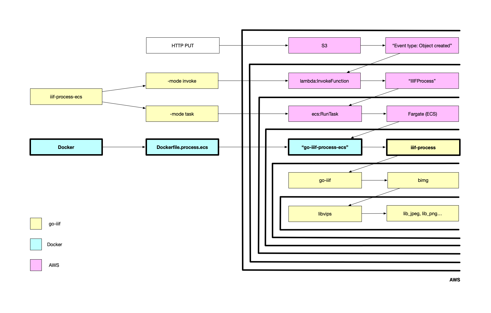

# go-iiif-aws

Go package for using go-iiif in AWS.

## Install

You will need to have both `Go` (specifically a version of Go more recent than 1.7 so let's just assume you need [Go 1.11](https://golang.org/dl/) or higher) and the `make` programs installed on your computer. Assuming you do just type:

```
make bin
```

All of this package's dependencies are bundled with the code in the `vendor` directory.

## Important

If you're reading this it means that the documentation is still being finalized.

## Docker

### go-iiif-process-ecs


```
make docker CONFIG=/usr/local/my-go-iiif-config.json INSTRUCTIONS=/usr/local/my-go-iiif-instructions.json
```

### ECS

...

## Tools

### iiif-process-ecs



Command line tool for working with the `go-iiif-process-ecs` -tagged Docker container (see above). It can be:

* Used to invoke a `iiif-process` task directly from the command-line, passing in one or more URIs to process.
* Bundled as an AWS Lambda function that can be run to invoke your task.
* Used to invoke that Lambda function (to invoke your task) from the command-line.

```
$> ./bin/iiif-process-ecs -h
Usage of ./bin/iiif-process-ecs:
  -cluster string
    	The name of your AWS ECS cluster.
  -config string
    	The path your IIIF config (on/in your container). (default "/etc/go-iiif/config.json")
  -container string
    	The name of your AWS ECS container.
  -ecs-dsn string
    	A valid ECS DSN.
  -instructions string
    	The path your IIIF processing instructions (on/in your container). (default "/etc/go-iiif/instructions.json")
  -lambda-dsn string
    	A valid Lambda DSN. Required if -mode is "invoke".
  -lambda-func string
    	A valid Lambda function name. Required if -mode is "invoke".
  -lambda-type string
    	A valid go-aws-sdk lambda.InvocationType string. Required if -mode is "invoke".
  -mode string
    	Valid modes are: lambda (run as a Lambda function), invoke (invoke this Lambda function), task (run this ECS task). (default "task")
  -security-group value
    	One of more AWS security groups your task will assume.
  -strip-paths
    	Strip directory tree from URIs. (default true)
  -subnet value
    	One or more AWS subnets in which your task will run.
  -task string
    	The name of your AWS ECS task (inclusive of its version number),
  -uri value
    	One or more valid IIIF URIs.
  -wait
    	Wait for the task to complete.
```

For example, if you just want to run the ECS task from the command-line:

```
$> iiif-process-ecs -mode task \
   -ecs-dsn 'region=us-east-1 credentials=session' \
   -subnet subnet-1234 \
   -security-group sg-5678 \
   -cluster iiif-process -container iiif-process \
   -task iiif-process:1 \
   -uri avocado.png \
   -uri toast.jpg 
```

Or, assuming you've installed this tool as a Lambda function (see below) and then want to _invoke_ that Lambda function from the command-line:

```
$> iiif-process-ecs -mode invoke \
   -lambda-dsn 'region=us-east-1 credentials=session' \
   -lambda-func 'ProcessIIIF` \
   -lambda-type 'FIX ME' \
   -uri avocado.png \
   -uri toast.jpg 
```

### Running `iiif-process-ecs` as a Lambda function

This assumes you've already set up your ECS task, which is outside the scope of this documentation.

First run the handy `lambda-process` target in the Makefile:

```
make lambda-process
```

Then create a new Go Lambda function in AWS and upload the resulting `process-task.zip` file. You will need to set the following environment variables:

| Environment variable | Value |
| --- | --- |
| `IIIF_PROCESS_ECS_DSN` | region=us-east-1 credentials=iam: |
| `IIIF_PROCESS_MODE` | lambda |
| `IIIF_PROCESS_SECURITY_GROUP` | sg-*** |
| `IIIF_PROCESS_SUBNET` | subnet-***,subnet-***,subnet-*** |
| `IIIF_PROCESS_TASK` | iiif-process:2 |

See the `IIIF_PROCESS_MODE=lambda` variable? That's important. Also, see the way we're passing options that can have multiple values (subnets, security groups, etc.) as comma-separated values? Yeah, that.

You'll need to make sure the role associated with your Lambda function has the following policies:

* `AWSLambdaExecute`
* A valid policy for reading from and writing to whatever S3 buckets are defined in your (IIIF) config
* Something like this:

```
{
    "Version": "2012-10-17",
    "Statement": [
        {
            "Sid": "Stmt1",
            "Effect": "Allow",
            "Action": [
                "ecs:RunTask"
            ],
            "Resource": [
                "arn:aws:ecs:us-west-2:{AWS_ACCOUNT_ID}:task-definition/{ECS_TASK}:*"
            ]
        },
        {
            "Sid": "Stmt2",
            "Effect": "Allow",
            "Action": [
                "iam:PassRole"
            ],
            "Resource": [
                "arn:aws:iam::{AWS_ACCOUNT_ID}:role/ecsTaskExecutionRole",
		"arn:aws:iam::{AWS_ACCOUNT_ID}:role/{ECS_TASK_ROLE}"
            ]
        }
    ]
}
```

## See also

* https://github.com/aaronland/go-iiif
* https://github.com/awslabs/aws-lambda-container-image-converter/